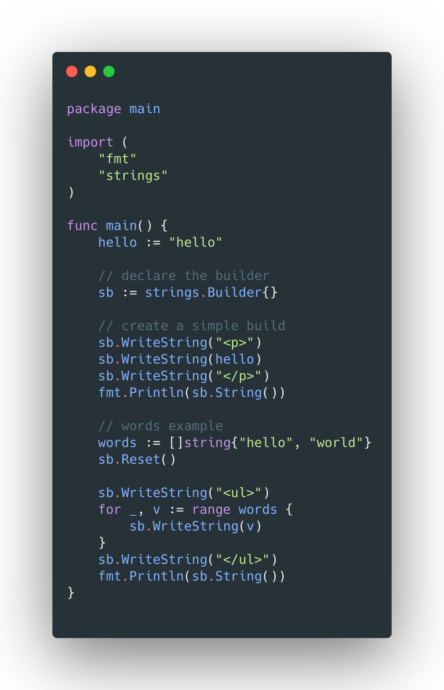
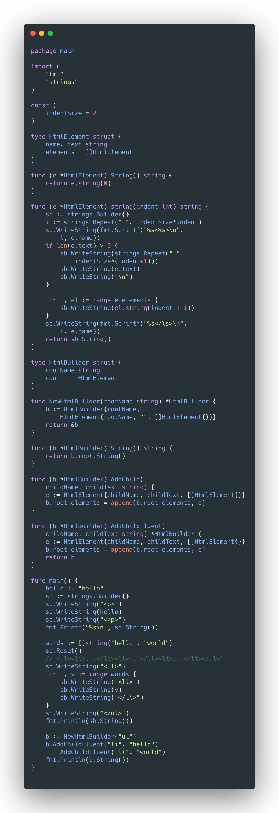
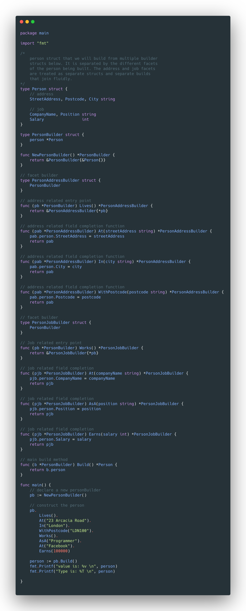
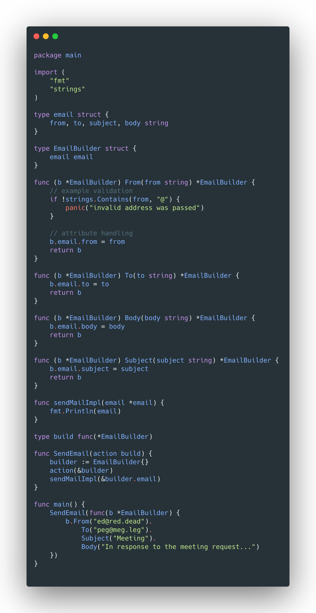

# The Builder design pattern in Go

### Example of Go SDK builder with strings.Builder.

We can use the sdk import `strings.Builder` to build patterns and strings. As an example we have simple html elements, or simple words being built t be rendered as a strings. This examples piecemeal construction rather than upfront completion beforehand.

### Builder

Builder uses a fluent interface construct to allow piecemeal struct construction. Using the html tag builder example.

### Builder Facets

Uses multiple builders to construct a more complex struct with facets, each builder is responsible for a particular related subset of facet of the overall struct.

### Builder Parameter

Uses a more closed approach to allow a builder to be declared and only the attribute completion elements exposed and the main purpose methods (actions).

### Functional Builder
